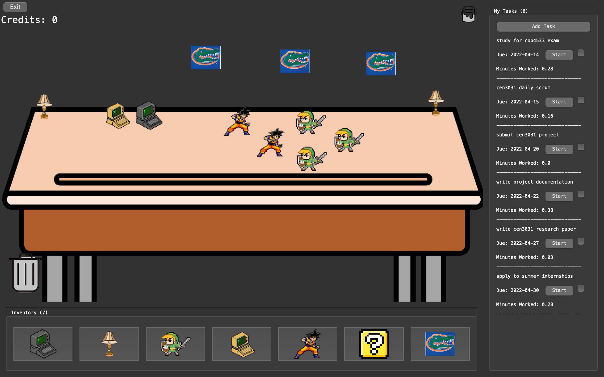

# Due Desk 
# 

## The virtual space that helps you get assignments done in a fun and rewarding way.

# Overview

- Automatically keeps your task list up to date maintaining the order by
earliest deadline first. 

- Gain credits to spend in your custom inventory store to
create your personal desk layout by logging minutes worked on tasks

- Save and load your tasks and desk layout for the next session.

# Downloading

1. Grab the latest release file. Download it to your local machine.

2. Decompress the tarball (.tar.gz) and open the terminal at the new folder.

3. Install DueDesk through pip.

```
$ pip install .
```

4. To open duedesk, open a terminal and enter:
```
$ duedesk
```


# Contributing

1. Clone this repository to your local machine.

```
$ git clone https://github.com/CEN3031-G33/due-desk.git 
$ cd ./due-desk
```

2. Build the development version.

```
$ pip install -e .
```

3. Run unit tests locally.

```
$ python -m unittest discover duedesk -v -p "*.py"
```

4. Run integration tests locally.

```
$ python -m unittest discover tests -v -p "main.py"
```

5. Check out a new branch to write code.

```
$ git checkout -b <name>
```

## Image credits

The images presented in the desk layout screenshot are not created by the duedesk team and were shamelessly taken off the internet for demo purposes only.